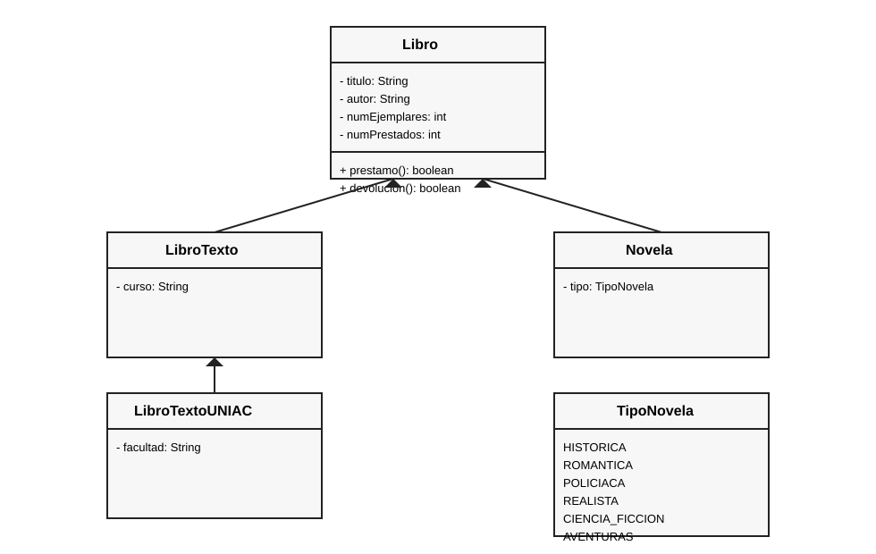

## Parcial I - Programacion II (G412)

Sistema de gestion de biblioteca usando POO (abstraccion, encapsulamiento y herencia).

**Estructura Maven:** el proyecto esta dentro de `parcial/`.

## Diagrama UML (captura)

## Como ejecutar

1. Entrar a la carpeta del proyecto: `cd parcial`
2. Compilar: `mvn -q -DskipTests package`
3. Ejecutar: `mvn -q exec:java`

## Lo que se pide en el parcial (resumen)

1. Clases: `Libro`, `LibroTexto`, `LibroTextoUNIAC`, `Novela` y `TipoNovela`.
2. Constructores, getters/setters y metodos `prestamo` y `devolucion`.
3. Cuatro objetos en `Main` y pruebas de prestamo/devolucion.
4. Dos casos donde no se puede heredar: ver `HerenciaInvalidaEjemplos`.
5. Dos atributos nuevos y un metodo adicional (ideas abajo).

## Ideas de mejora (pedido extra)

- Atributo 1: `anioPublicacion` (int).
- Atributo 2: `isbn` (String).
- Metodo extra: `estaDisponible()` que devuelva `true` si hay ejemplares libres.

## Notas

- `libro2` se llena por consola con `Scanner`.
- Los metodos de prestamo y devolucion devuelven `true/false` segun se pueda hacer la operacion.
- Ajuste pequeño en README para el PR.
